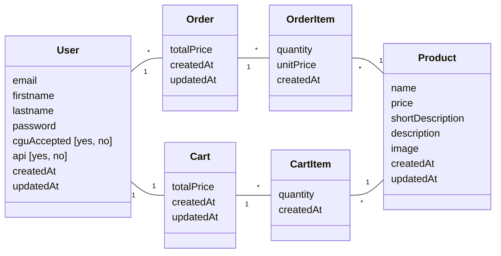

# Formation_OC_Symfony_P13_ecommerce-And-API

```mermaid
classDiagram
direction LR
    class Cart {
        totalPrice
        createdAt
        updatedAt
    }

    class Order {
        totalPrice
        createdAt
        updatedAt
    }
    
    class User {
	    email
	    firstname
	    lastname
	    password
	    cguAccepted [yes, no]
	    api [yes, no]
        createdAt
        updatedAt
    }

    class Product {
        name
        price
        shortDescription
        description
        image
        createdAt
        updatedAt
    }

    class OrderItem {
        quantity
        unitPrice
        createdAt
    }

    class CartItem {                                                                                                                                                                          
        quantity
        createdAt
    } 

    User "1" -- "1" Cart
    User "1" -- "*" Order
    Order "1" -- "*" OrderItem
    OrderItem "*" -- "1" Product
    Cart "1" -- "*" CartItem
    CartItem "*" -- "1" Product
```