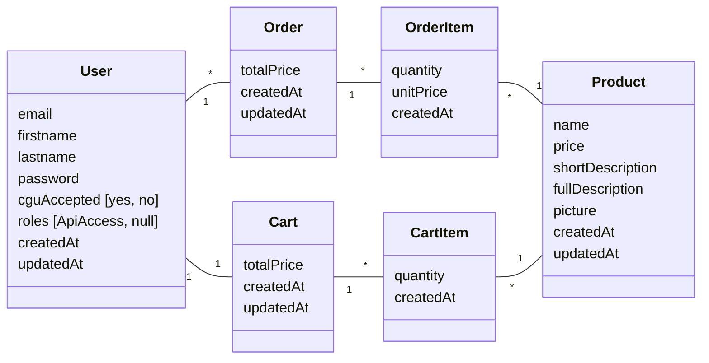

# GreenGoodies — Site e-commerce et API

## Description

Site e-commerce de GreenGoodies, boutique lyonnaise spécialisée dans la vente
de produits biologiques, éthiques et écologiques. Le projet comprend deux volets :

- Une partie **front** permettant aux clients de consulter les produits,
  s'authentifier et passer commande.
- Une **API** permettant à des partenaires d'afficher les produits sur leur site,
  avec une route d'authentification et une route de listing produits. L'accès à
  l'API est activable par l'utilisateur depuis la gestion de son compte.

## Prérequis
- PHP 8.4
- Symfony 7.4.X (installé via Composer)
- Autres dépendances PHP et Symfony installées via Composer

## Installation du projet

### 1. Cloner le projet

```bash
git clone https://github.com/Vivien60/Formation_OC_Symfony_P13_ecommerce-And-API.git
cd Formation_OC_Symfony_P13_ecommerce-And-API
composer install
```
Créez votre fichier environnement (.env*).

### 2. Configuration de la base de données

#### 2.1 Créer la base de données
- Spécifiez le connecteur à votre base de données dans votre .env local, ainsi que les variables indiquées dans le .env et le .env.dev
- Puis :
    ```bash
    php bin/console doctrine:database:create
    php bin/console doctrine:migrations:migrate
    ```
- Mettre en place une config JWT (le bundle utilisé est `lexik/jwt-authentication-bundle`) :
  Si vous n'avez pas de clés RSA, il faut en générer et les indiquer dans votre .env 
  (cf constantes signalées non initialisées dans le .env) :
        ```bash
        php bin/console lexik:jwt:generate-keypair
        ```

#### 2.2 Générer des données
Des fixtures ont été créées pour générer des données aléatoires (utilisateurs, produits).
Avant de les lancer, vérifiez que vous avez bien défini un mot de passe par défaut (cf .env).
Ensuite, exécutez les fixtures ainsi :
- `php bin/console doctrine:fixtures:load`

## 3. Assets
Si vous êtes en environnement type prod, ou dans un environnement ou vous souhaitez compiler ou minifier les assets (JS, CSS...) :

`php bin/console asset-map:compile`


## 4. Structure du projet

### Structure du projet
Symfony webapp classique, avec quelques bundles en plus détaillés plus bas.

### Modèle de données



### Fonctionnalités

**Front-end**
- Inscription, connexion et gestion du compte utilisateur
- Consultation du catalogue de produits
- Gestion du panier (ajout, modification, suppression)
- Validation du panier et création de commande
- Activation/désactivation de l'accès à l'API depuis l'espace compte

**API**
- endpoint /api/login : Authentification via JWT
- endpoint /api/products : Listing des produits, accessible aux utilisateurs ayant activé l'accès API

### Technologies utilisées

- **Backend** : PHP 8.4 avec Symfony 7.4
- **ORM** : Doctrine
- **Authentification API** : JWT via `lexik/jwt-authentication-bundle`
- **Pagination** : `babdev/pagerfanta-bundle`
- **Fixtures** : `zenstruck/foundry`
- **Assets** : minification de CSS et JS via `sensiolabs/minify-bundle`
- **Base de données** : MySQL
- **Versionning** : Git

Ce projet est développé dans le cadre du parcours OpenClassrooms "Développeur d'application PHP/Symfony".